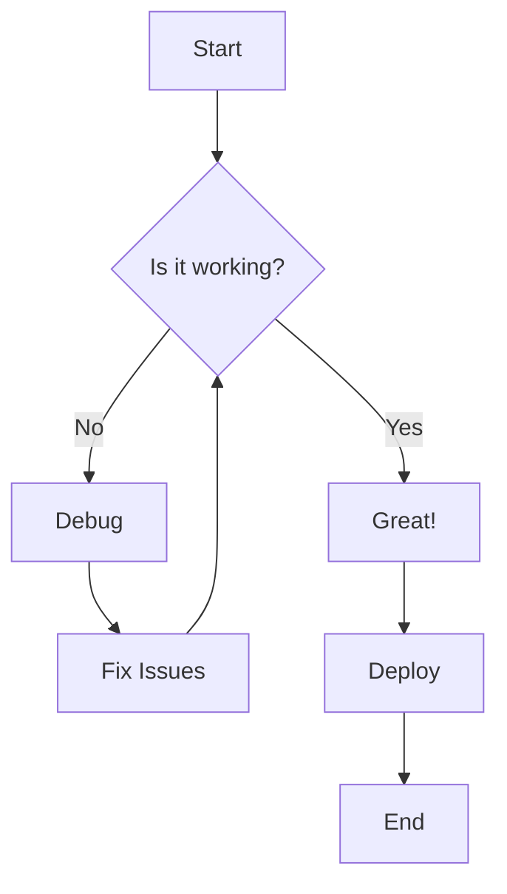
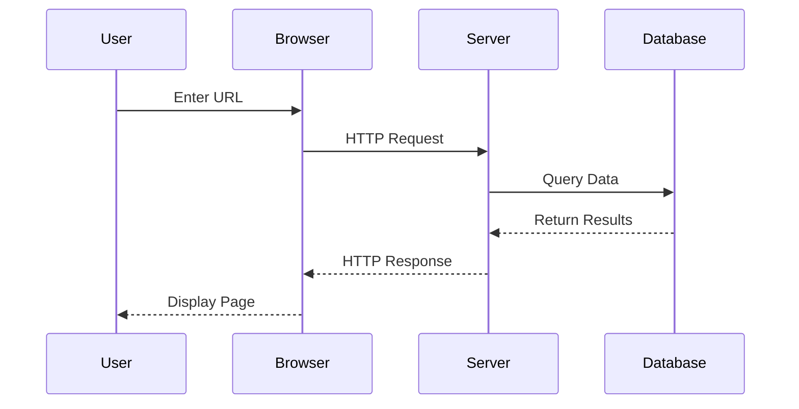
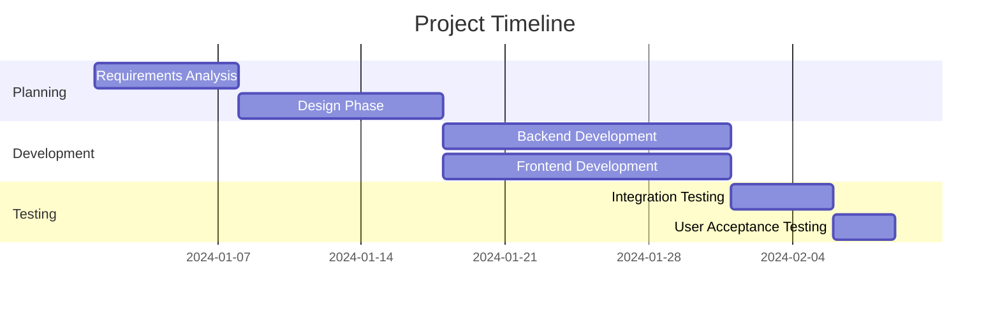

Welcome to the complete Markdown features showcase! This post demonstrates all the advanced Markdown capabilities supported by this blog. :rocket:

## Table of Contents

This blog supports Obsidian-level Markdown features, making it perfect for technical writing, documentation, and knowledge sharing.

## Callouts / Admonitions

Callouts help highlight important information with visual distinction.

> [!NOTE]
> This is a note callout. Use it for additional context or helpful information that readers should be aware of.

> [!TIP]
> This is a tip callout. Share best practices, shortcuts, or helpful suggestions here.

> [!IMPORTANT]
> This is an important callout. Highlight critical information that readers must understand.

> [!WARNING]
> This is a warning callout. Alert readers about potential issues or things to watch out for.

> [!CAUTION]
> This is a caution callout. Warn about dangerous operations or actions that could cause problems.

## Task Lists

Track your progress with interactive checkboxes:

- [x] Install required dependencies
- [x] Configure build system
- [x] Add Markdown extensions
- [ ] Write comprehensive documentation
- [ ] Deploy to production
- [x] Test all features
- [ ] Gather user feedback

## Math Equations

### Inline Math

The quadratic formula is $x = \frac{-b \pm \sqrt{b^2 - 4ac}}{2a}$ and Euler's identity is $e^{i\pi} + 1 = 0$.

### Block Math

The Gaussian distribution:

$$
f(x) = \frac{1}{\sigma\sqrt{2\pi}} e^{-\frac{1}{2}\left(\frac{x-\mu}{\sigma}\right)^2}
$$

The Fourier Transform:

$$
F(\omega) = \int_{-\infty}^{\infty} f(t) e^{-i\omega t} dt
$$

## Mermaid Diagrams

### Flowchart



### Sequence Diagram



### Gantt Chart



## Code Blocks with Syntax Highlighting

### JavaScript

```javascript
// Advanced async/await pattern
async function fetchUserData(userId) {
    try {
        const response = await fetch(`/api/users/${userId}`);
        const data = await response.json();
        return data;
    } catch (error) {
        console.error('Error fetching user:', error);
        throw error;
    }
}
```

### Python

```python
# Data processing with pandas
import pandas as pd
import numpy as np

def analyze_data(df):
    """Perform statistical analysis on dataframe"""
    summary = df.describe()
    correlations = df.corr()
    
    return {
        'summary': summary,
        'correlations': correlations,
        'missing_values': df.isnull().sum()
    }
```

### YAML

```yaml
# Kubernetes deployment configuration
apiVersion: apps/v1
kind: Deployment
metadata:
  name: web-app
  labels:
    app: web
spec:
  replicas: 3
  selector:
    matchLabels:
      app: web
  template:
    metadata:
      labels:
        app: web
    spec:
      containers:
      - name: nginx
        image: nginx:1.21
        ports:
        - containerPort: 80
```

## Tables

### Feature Comparison

| Feature | Basic Markdown | GFM | Obsidian | This Blog |
|---------|---------------|-----|----------|-----------|
| Headings | ✅ | ✅ | ✅ | ✅ |
| Lists | ✅ | ✅ | ✅ | ✅ |
| Code Blocks | ✅ | ✅ | ✅ | ✅ |
| Tables | ❌ | ✅ | ✅ | ✅ |
| Task Lists | ❌ | ✅ | ✅ | ✅ |
| Footnotes | ❌ | ❌ | ✅ | ✅ |
| Math | ❌ | ❌ | ✅ | ✅ |
| Diagrams | ❌ | ❌ | ✅ | ✅ |
| Callouts | ❌ | ❌ | ✅ | ✅ |

### Performance Metrics

| Metric | Before | After | Improvement |
|--------|--------|-------|-------------|
| Build Time | 45s | 12s | 73% faster |
| Bundle Size | 2.3 MB | 890 KB | 61% smaller |
| Lighthouse Score | 72 | 98 | +26 points |
| Time to Interactive | 3.8s | 1.2s | 68% faster |

## Footnotes

Footnotes are perfect for adding references or additional context[^1]. You can reference the same footnote multiple times[^1] or create new ones[^2].

Here's a sentence with a footnote that has a longer explanation[^3].

## Text Formatting

### Basic Formatting

This is **bold text** and this is *italic text*. You can also use ***bold and italic*** together.

Use ~~strikethrough~~ for deleted content and ==highlighted text== for emphasis.

### Subscript and Superscript

Chemical formula: H~2~O

Mathematical notation: E = mc^2^

### Inline Code

Use `const` for constants and `let` for variables in JavaScript. The `kubectl apply -f` command deploys resources to Kubernetes.

## Blockquotes

> "The best way to predict the future is to invent it."
> — Alan Kay

> This is a multi-line blockquote.
> It can span several lines and maintain
> consistent formatting throughout.

## Lists

### Ordered Lists

1. First item
2. Second item
   1. Nested item 2.1
   2. Nested item 2.2
3. Third item

### Unordered Lists

- Main point one
- Main point two
  - Sub-point 2.1
  - Sub-point 2.2
    - Deep nested point
- Main point three

### Mixed Lists

1. Start with ordered
   - Mix in unordered
   - Another unordered item
2. Back to ordered
   1. Nested ordered
   2. Another nested

## Emoji Support

Express yourself with emoji! :smile: :heart: :rocket:

Common tech emoji:
- :computer: Development
- :cloud: Cloud Computing
- :lock: Security
- :chart: Analytics
- :fire: Performance
- :bulb: Ideas
- :gear: Configuration
- :trophy: Achievements

## Horizontal Rules

Use horizontal rules to separate sections:

---

## Links and Images

### Links

Visit my [GitHub profile](https://github.com) or check out the [documentation](https://example.com).

### Images


## Definition Lists

Term 1
: Definition for term 1

Term 2
: Definition for term 2
: Another definition for term 2

API
: Application Programming Interface

REST
: Representational State Transfer

## Advanced Features

### Nested Blockquotes

> This is a blockquote
> > This is a nested blockquote
> > > And this is even more nested

### Complex Task Lists with Nested Items

- [x] Phase 1: Planning
  - [x] Define requirements
  - [x] Create mockups
  - [x] Get stakeholder approval
- [x] Phase 2: Development
  - [x] Set up environment
  - [x] Implement features
  - [ ] Code review
- [ ] Phase 3: Testing
  - [ ] Unit tests
  - [ ] Integration tests
  - [ ] User acceptance testing

## Conclusion

This showcase demonstrates the full power of Obsidian-level Markdown support in this blog. Whether you're writing technical documentation, tutorials, or blog posts, you have access to:

✅ Rich callouts and admonitions  
✅ Mathematical equations with KaTeX  
✅ Interactive diagrams with Mermaid  
✅ Task lists for tracking progress  
✅ Comprehensive tables  
✅ Footnotes for references  
✅ Emoji support  
✅ And much more!

Happy writing! :rocket: :star:

[^1]: This is a footnote with a simple explanation.
[^2]: Footnotes can contain more complex information and even [links](https://example.com).
[^3]: This footnote demonstrates that you can include **formatted text**, `code snippets`, and other Markdown elements within footnotes for richer documentation.
