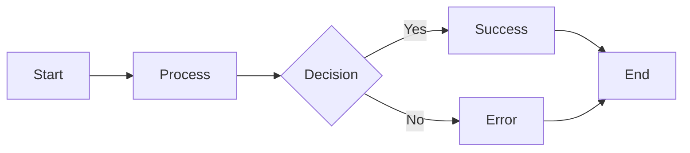
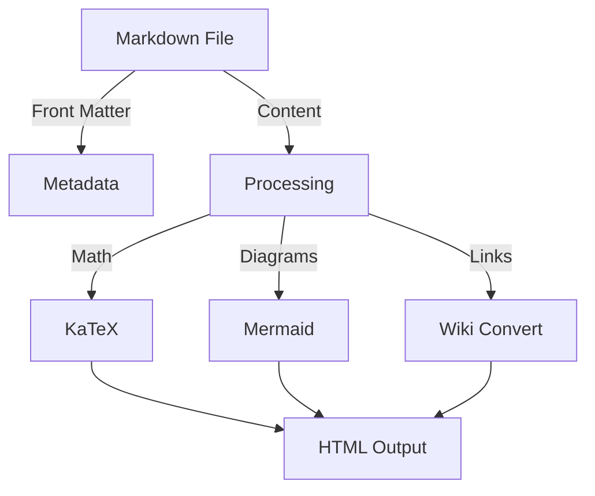
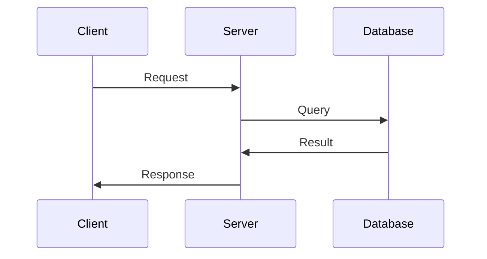

This portfolio now supports advanced Obsidian-like markdown features! Here's a comprehensive guide to what you can use.

## 📝 Callouts (Admonitions)

Obsidian-style callouts are fully supported:

> [!NOTE]
> This is a note callout. Use it for general information.

> [!TIP]
> This is a tip callout. Use it for helpful suggestions.

> [!WARNING]
> This is a warning callout. Use it to alert readers.

> [!IMPORTANT]
> This is for important information that shouldn't be missed.

> [!CAUTION]
> This is for cautionary information about risks.

## 🔗 Wiki-Style Links

Reference other blog posts using Obsidian-style wiki links:

- Link to post: [[terraform-vs-cloudformation]]
- Link with date: [[2024-11-28-cicd-pipelines-best-practices]]

These automatically convert to clickable links within your blog!

## 📐 Math Equations

Write mathematical expressions using KaTeX:

### Block Math

$$
E = mc^2
$$

$$
\sum_{i=1}^{n} i = \frac{n(n+1)}{2}
$$

### Inline Math

The quadratic formula is $x = \frac{-b \pm \sqrt{b^2 - 4ac}}{2a}$ and it's very useful.

## 📊 Mermaid Diagrams

Create beautiful diagrams using Mermaid syntax:



### Flowchart Example



### Sequence Diagram



## 📚 Footnotes

Add footnotes to your content[^1] and reference them later[^2].

[^1]: This is the first footnote explaining something important.
[^2]: This is the second footnote with additional context.

## 📋 Task Lists

Track your tasks with checkboxes:

- [x] Completed task
- [ ] Pending task
- [x] Another completed task
- [ ] Work in progress

## 📊 Tables

Create structured data with tables:

| Feature    | Supported | Notes                  |
| ---------- | --------- | ---------------------- |
| Callouts   | ✅         | All 5 types supported  |
| Wiki Links | ✅         | Automatic conversion   |
| Math       | ✅         | KaTeX rendering        |
| Diagrams   | ✅         | Mermaid support        |
| Footnotes  | ✅         | Full support           |
| Task Lists | ✅         | Interactive checkboxes |

## 💻 Code Syntax Highlighting

Code blocks with multiple language support:

```python
def fibonacci(n):
    if n <= 1:
        return n
    return fibonacci(n-1) + fibonacci(n-2)
```

```javascript
const greet = (name) => {
    return `Hello, ${name}!`;
};

console.log(greet('World'));
```

```bash
#!/bin/bash
echo "Building the project..."
npm run build
echo "Build complete!"
```

## 🎨 Text Formatting

You can use various text formatting options:

- **Bold text** for emphasis
- *Italic text* for nuance
- ***Bold italic text*** for strong emphasis
- ~~Strikethrough text~~ for removed content
- `inline code` for commands
- ==Highlighted text== for important points

## 📌 Blockquotes

Standard blockquotes are also enhanced:

> "The only way to do great work is to love what you do." — Steve Jobs

> This is a regular blockquote that looks great and is easy to read in the blog format.

## 🔜 Coming Soon

We're constantly improving! Future enhancements may include:

- Embed support
- Link previews on hover
- Backlink references
- Graph visualization
- Transclusion

---

**Happy writing!** You now have a powerful Obsidian-compatible markdown blog. Start creating amazing content! 🚀
